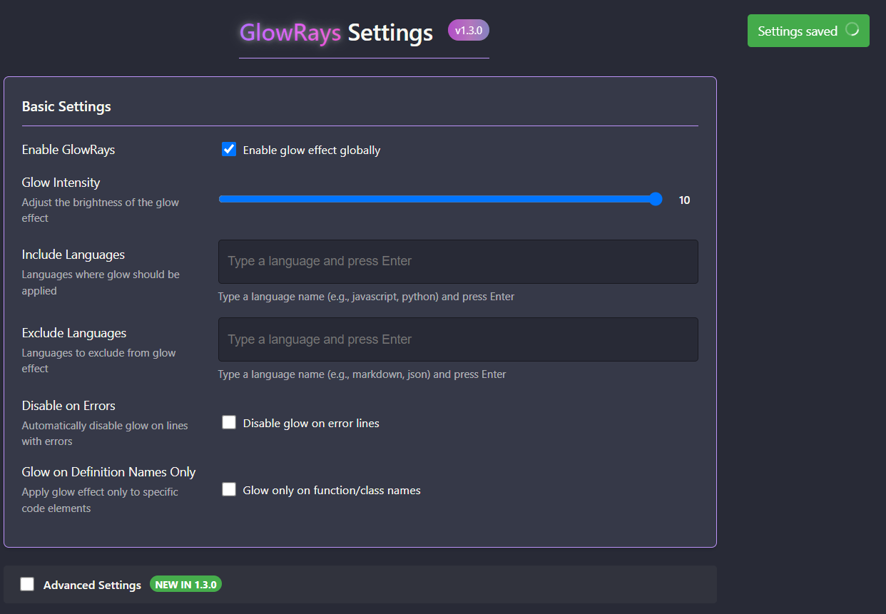

# GlowRays VSCode Extension

<a href="https://marketplace.visualstudio.com/items?itemName=imagineSamurai.glowrays"></a>
<a href="https://marketplace.visualstudio.com/items?itemName=imagineSamurai.glowrays"></a>
<a href="https://marketplace.visualstudio.com/items?itemName=imagineSamurai.glowrays"></a>
<a href="https://x.com/GlowRays_VSC"></a>

> ## ⚠️ DYNAMIC FEATURES ALPHA NOTICE
> The core glow functionality of this extension works great! Only the **dynamic intensity feature** is currently in alpha development.
> Due to VS Code API limitations, the dynamic glow effect may cause performance issues on some systems.
> Dynamic features are disabled by default and can be manually enabled if desired.
> 
> **If you can fix it, fork it!** Contributions to improve the dynamic features are welcome.

A Visual Studio Code extension that makes text glow with the same color as the syntax highlighting, creating a beautiful neon effect in your editor.

## ✨ Features

- **Glowing Text**: Applies a customizable glow effect to text in the editor
- **Theme Compatible**: Preserves the original syntax highlighting colors from your theme
- **Error Highlighting**: Automatically disables glow effect on lines with errors
- **Dynamic Glow Effects**: (v1.3.0)
  - "Breathing" effect that animates intensity over time
  - Customizable min/max intensity range
  - Adjustable animation speed 
  - Pause animation while typing option to reduce distractions
- **Visual Settings UI**: (v1.3.0)
  - Dedicated interface for all configuration options
  - Intuitive sliders and toggles for easy adjustments
  - Warning dialogs for experimental features
  - Real-time preview of settings changes
- **Advanced Settings Mode**: (v1.3.0)
  - Access to higher intensity levels beyond standard limits
  - Fine-grained control over dynamic glow parameters
  - Performance warnings for low-end devices
- **Language Control**: Enable or disable for specific programming languages
- **Selective Glow**: Option to apply glow only to specific code elements like function definitions and class names
- **Performance Optimized**: Minimal impact on editor performance for most files


## 📋 Requirements

- Visual Studio Code v1.80.0 or higher

## 🔧 Installation

### VS Code Marketplace
#### First method 
1. Open **Extensions** sidebar panel in VS Code. (`Ctrl+Shift+X` or `Cmd+Shift+X`)
2. Search for `GlowRays`
3. Click **Install**
4. Reload VS Code
5. Enjoy the glow!

#### Second method
1. Visit [GlowRays on Marketplace](https://marketplace.visualstudio.com/items?itemName=imagineSamurai.glowrays).
2. Click **Install**.
3. Follow the installation instructions for VS Code.
4. Reload VS Code.
5. Enjoy the glow!

### Direct Download (VSIX)

1. Go to the [releases page](https://github.com/imagineSamurai/GlowRays/releases)
2. Download the latest `.vsix` file
3. In VS Code, go to Extensions view
4. Click on the "..." menu in the upper right
5. Select "Install from VSIX..."
6. Choose the downloaded file
7. Reload VS Code

### Manual Installation from Source

```bash
# Clone the repository
git clone https://github.com/imagineSamurai/GlowRays.git

# Navigate to the project directory
cd GlowRays

# Install dependencies
npm install


# Package the extension
npx vsce package

# Install the generated .vsix file in VS Code
code --install-extension glowrays-*.vsix
```

## ⚙️ Extension Settings

This extension contributes the following settings:

### Basic Settings

* `glowrays.enable`: Enable/disable the glow effect globally
* `glowrays.intensity`: Intensity of the glow effect (1-10)
* `glowrays.includeLanguages`: Languages to include for glow effect (e.g., `["javascript", "python"]`)
* `glowrays.excludeLanguages`: Languages to exclude from glow effect (e.g., `["markdown", "json"]`)
* `glowrays.disableOnErrors`: Enable/disable automatic disabling of glow effect on lines with errors (default: true)
* `glowrays.GlowOnDefinitionNames`: Apply glow effect only to specific code elements like function names, class definitions, etc. (default: false)

### Advanced Settings (v1.3.0)

* `glowrays.advancedMode`: Enable advanced settings mode with additional configuration options (default: false)
* `glowrays.dynamic.config`: Dynamic intensity configuration in format 'min max speed enabled' (e.g., '3 8 5 true'). Set the last parameter to 'true' to enable.
  * First value: Minimum intensity (1-10)
  * Second value: Maximum intensity (2-30)
  * Third value: Animation speed (1-10, higher is faster)
  * Fourth value: Enabled state ('true' or 'false')
* `glowrays.pauseAnimationWhileTyping`: Pause animation updates during typing to prevent flickering (default: false)

## 🚀 Getting Started

After installation, the extension is enabled by default with medium intensity. You can customize the settings in two ways:

### Using the Visual Settings UI (Recommended)

The new visual Settings UI in v1.3.0 makes it easy to configure all aspects of GlowRays:

1. Press `Ctrl+Shift+P` or `Cmd+Shift+P` to open the command palette
2. Type "Open GlowRays Settings" and select it
3. Use the friendly interface to adjust your settings:
   - Basic settings are shown by default
   - Toggle "Advanced Settings" to access dynamic glow features and high-intensity options
   - All changes are saved automatically

### Using VS Code Settings

Alternatively, you can configure GlowRays through the standard VS Code settings:

1. Open VS Code settings (`Ctrl+,` or `Cmd+,`)
2. Search for "GlowRays"
3. Adjust the settings to your preference

### Example JSON Settings

Add these to your `settings.json` file:

```json
{
    "glowrays.enable": true,
    "glowrays.intensity": 7,
    "glowrays.includeLanguages": ["javascript", "typescript", "python"],
    "glowrays.excludeLanguages": ["markdown", "plaintext"],
    "glowrays.disableOnErrors": true
}
```

To enable advanced features (v1.3.0):

```json
{
    "glowrays.advancedMode": true,
    "glowrays.dynamic.config": "3 8 5 true",
    "glowrays.pauseAnimationWhileTyping": true
}
```

To enable the focused definition glow feature:

```json
{
    "glowrays.GlowOnDefinitionNames": true
}
```

## 📸 Screenshots

[Quick comment]: <> (If you are in the Marketplace and want to see the image, go to the project repository)

### GlowRays UI (**only on v1.3.0**)



### JavaScript with Glow Effect


### Python with Glow Effect


### Different Intensity Levels
#### intensity = 1


#### intensity = 10


#### intensity = 20

## 🔍 Troubleshooting

### Common Issues

- **Extension not working after installation**: Make sure to reload VS Code after installation
- **No glow effect visible**: Check if your theme has sufficient contrast for the glow to be visible
- **Performance issues with large files**: Try reducing the intensity level in settings
- **Flickering or flashing while typing**: Ensure that `glowrays.pauseAnimationWhileTyping` is set to `true` (the default). This will keep the glow static while you type, preventing any disruptions.

### Avoiding Editor Flashing/Flickering

If you experience any disruptions or flickering while typing:

1. Make sure `glowrays.pauseAnimationWhileTyping` is enabled (it is by default)
2. Use a moderate glow intensity (3-8 is recommended)
3. If using dynamic glow, use a narrower range in your `glowrays.dynamic.config` setting (e.g., "3 6 5 true")
4. Try disabling other extensions that modify text appearance to avoid conflicts

### Compatibility

GlowRays works with most popular VS Code themes. If you encounter issues with a specific theme, please report it in the [Issues](https://github.com/imagineSamurai/GlowRays/issues) section.

## ⚠️ Known Issues

- **Dynamic features limitations**: The dynamic intensity feature is still in alpha development and may cause performance issues, flickering, or editor lag on some systems.
- **Large files impact**: Performance may be impacted on large files, especially with dynamic features enabled.
- **Theme compatibility**: Some color themes may produce inconsistent glow effects.
- **Custom fonts**: Might not work properly with certain custom font settings.

**If you can fix it, fork it!** Pull requests to address these issues are greatly appreciated!

### Performance Recommendations

If you experience performance issues with dynamic features:

1. Keep `glowrays.dynamic.config` disabled by leaving the last parameter as "false"
2. Use a static intensity value instead (the default setting)
3. Consider disabling the extension for very large files

## 📝 Release Notes

### Version 1.3.1 & 1.3.2

> We are excited to announce the release of **Version 1.3.1** & **Version 1.3.2**!
> 
> This update was issued to address a technical issue encountered during the publishing process to the marketplace.  
> There were no code changes or feature updates compared to Version 1.3.0.  
> The sole purpose of this release is to ensure proper delivery and availability of the extension/application for all users through the marketplace.


### 📝 What's New in v1.3.0

- **Settings UI**: Visual interface to configure all GlowRays settings
- **Advanced Settings Mode**: Dedicated section for advanced features with warning for low-end devices
- **Enhanced Dynamic Glow**: Improved "breathing" glow effect with:
  - Customizable minimum and maximum intensity values
  - Adjustable animation speed via intuitive volume slider
  - Warning dialog explaining alpha status
  - Improved performance when typing
- **Improved UI/UX**:
  - Intuitive volume sliders for all numeric settings
  - Automatic greying out of controls when features are disabled
  - Warning dialogs for experimental features
  - More descriptive tooltips and labels
- **User-Friendly Inputs**: Simplified language selection with intuitive tag system
- **Improved Visuals**: Better labels and descriptions for all settings
- **Bug Fixes**: Various small improvements and fixes including:
  - Fixed settings persistence for Advanced Mode
  - Improved dynamic glow animation smoothness
  - Better error handling for configuration

### 1.2.0

- Added dynamic intensity feature (alpha) that makes the glow effect "breathe" by automatically varying intensity over time
- Added pause animation while typing feature (alpha) to reduce flickering during editing
- Added automatic error detection feature that disables glow on lines with errors
- Added configuration options for dynamic features
- Added GlowOnDefinitionNames feature to focus glow effect only on code definitions
- Performance improvements and bug fixes

### 1.0.0

Initial release of GlowRays Extension:
- Basic glow effect for text that preserves theme colors
- Configurable intensity
- Language filtering options

## 🤝 Contributing

Contributions are welcome! Please feel free to submit a Pull Request.

1. Fork the repository
2. Create your feature branch (`git checkout -b feature/amazing-feature`)
3. Commit your changes (`git commit -m 'Add some amazing feature'`)
4. Push to the branch (`git push origin feature/amazing-feature`)
5. Open a Pull Request

### Development Setup

```bash
# Clone your fork
git clone https://github.com/imagineSamurai/GlowRays.git

# Install dependencies
npm install

# Open in VS Code
code .

# Press F5 to start debugging
```

## 📄 License

This project is licensed under the MIT License - see the [LICENSE](LICENSE) file for details.

## 👨‍💻 Author

[imagineSamurai](https://github.com/imagineSamurai)

## 💖 Support

If you find this extension useful, please consider:

- ⭐ Star this repository on GitHub
- 🌟 Rate it on the VS Code Marketplace
- 📢 Share it with friends and colleagues
- 🐦 Follow us on X (Twitter): [@GlowRays_VSC](https://twitter.com/GlowRays_VSC)
- ☕ You can support me by using [Ko-fi](https://ko-fi.com/imaginesamurai)

