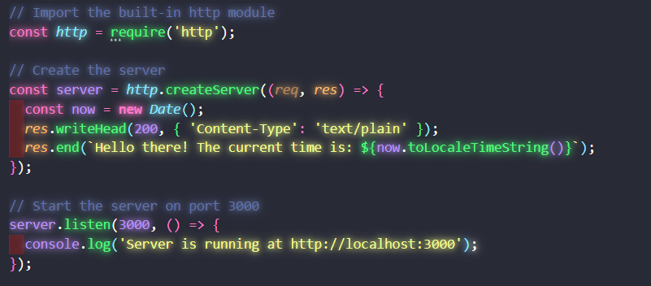
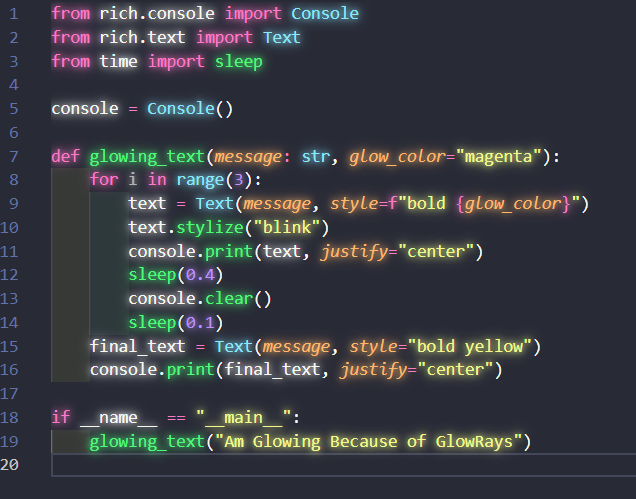

# GlowRays VSCode Extension


A Visual Studio Code extension that makes text glow with the same color as the syntax highlighting, creating a beautiful neon effect in your editor.

## ✨ Features

- **Glowing Text**: Applies a customizable glow effect to text in the editor
- **Theme Compatible**: Preserves the original syntax highlighting colors from your theme
- **Configurable**: Adjust glow intensity to match your preferences
- **Language Control**: Enable or disable for specific programming languages
- **Performance Optimized**: Minimal impact on editor performance for most files


## 📋 Requirements

- Visual Studio Code v1.80.0 or higher

## 🔧 Installation

### VS Code Marketplace

1. Open **Extensions** sidebar panel in VS Code. (`Ctrl+Shift+X` or `Cmd+Shift+X`)
2. Search for `GlowRays`
3. Click **Install**
4. Reload VS Code
5. Enjoy the glow!

### Direct Download (VSIX)

1. Go to the [releases page](https://github.com/imagineSamurai/GlowRays/releases)
2. Download the latest `.vsix` file
3. In VS Code, go to Extensions view
4. Click on the "..." menu in the upper right
5. Select "Install from VSIX..."
6. Choose the downloaded file
7. Reload VS Code

### Manual Installation from Source

```bash
# Clone the repository
git clone https://github.com/imagineSamurai/GlowRays.git

# Navigate to the project directory
cd GlowRays

# Install dependencies
npm install


# Package the extension
npx vsce package

# Install the generated .vsix file in VS Code
code --install-extension glowrays-*.vsix
```

## ⚙️ Extension Settings

This extension contributes the following settings:

* `vscodeGlow.enable`: Enable/disable the glow effect globally
* `vscodeGlow.intensity`: Intensity of the glow effect (1-10)
* `vscodeGlow.includeLanguages`: Languages to include for glow effect (e.g., `["javascript", "python"]`)
* `vscodeGlow.excludeLanguages`: Languages to exclude from glow effect (e.g., `["markdown", "json"]`)

## 🚀 Getting Started

After installation, the extension is enabled by default with medium intensity. You can customize the settings by:

1. Opening VS Code settings (`Ctrl+,` or `Cmd+,`)
2. Searching for "GlowRays"
3. Adjusting the settings to your preference

### Example JSON Settings

Add these to your `settings.json` file:

```json
{
    "vscodeGlow.enable": true,
    "vscodeGlow.intensity": 7,
    "vscodeGlow.includeLanguages": ["javascript", "typescript", "python"],
    "vscodeGlow.excludeLanguages": ["markdown", "plaintext"]
}
```

## 📸 Screenshots

### JavaScript with Glow Effect


### Python with Glow Effect


### Different Intensity Levels


## 🔍 Troubleshooting

### Common Issues

- **Extension not working after installation**: Make sure to reload VS Code after installation
- **No glow effect visible**: Check if your theme has sufficient contrast for the glow to be visible
- **Performance issues with large files**: Try reducing the intensity level in settings

### Compatibility

GlowRays works with most popular VS Code themes. If you encounter issues with a specific theme, please report it in the [Issues](https://github.com/imagineSamurai/GlowRays/issues) section.

## ⚠️ Known Issues

- Performance may be impacted on large files
- Some color themes may produce inconsistent glow effects
- Might not work properly with certain custom font settings

## 📝 Release Notes

### 0.0.1

Initial release of GlowRays Extension:
- Basic glow effect for text that preserves theme colors
- Configurable intensity
- Language filtering options

## 🤝 Contributing

Contributions are welcome! Please feel free to submit a Pull Request.

1. Fork the repository
2. Create your feature branch (`git checkout -b feature/amazing-feature`)
3. Commit your changes (`git commit -m 'Add some amazing feature'`)
4. Push to the branch (`git push origin feature/amazing-feature`)
5. Open a Pull Request

### Development Setup

```bash
# Clone your fork
git clone https://github.com/YOUR_USERNAME/GlowRays.git

# Install dependencies
npm install

# Open in VS Code
code .

# Press F5 to start debugging
```

## 📄 License

This project is licensed under the MIT License - see the [LICENSE](LICENSE) file for details.

## 👨‍💻 Author

[imagineSamurai](https://github.com/imagineSamurai)

## 💖 Support

If you find this extension useful, please consider:

- ⭐ Star this repository on GitHub
- 🌟 Rate it on the VS Code Marketplace
- 📢 Share it with friends and colleagues 
